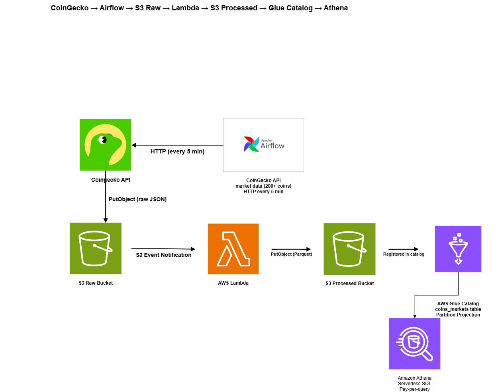

# Cryptocurrency Data Pipeline (AWS)

A serverless ETL pipeline for near real-time cryptocurrency market analysis. Ingests data from the **CoinGecko** API every 5 minutes, transforms it through an automated processing layer, and makes it queryable via SQL using Amazon Athena.

---

## Architecture



---

## Tech Stack

| Layer | Technology |
|---|---|
| Orchestration | Apache Airflow (Astronomer) |
| Local Dev | Docker / Docker Compose |
| Data Sources | CoinGecko API |
| Raw Storage | Amazon S3 (JSON, Hive-partitioned) |
| Transformation | AWS Lambda + AWSSDKPandas Layer |
| Processed Storage | Amazon S3 (Parquet / Snappy) |
| Data Catalog | AWS Glue (Partition Projection) |
| Query Engine | Amazon Athena (engine v3) |
| IaC | Terraform |
| Error Handling | SQS Dead Letter Queue |
| Monitoring | Amazon CloudWatch |

---

## Pipeline Flow

### 1. Ingestion (Airflow)

An Airflow DAG runs on a **5-minute schedule**:

- **`coingecko_coins_markets_s3_raw`** — fetches market data (price, market cap, volume, % change) for **200+ cryptocurrencies** via paginated CoinGecko API calls and writes newline-delimited JSON to S3.

S3 raw path structure (Hive-partitioned):
```
s3://crypto-data-pipeline-raw-dev/
  raw/
    source=coingecko/
      dataset=coins_markets/
        date=YYYY-MM-DD/
          hour=HH/
            data_YYYYMMDDTHHMMSSZ.json
```

### 2. Transformation (Lambda)

An **S3 Event Notification** triggers a Lambda function on every `raw/*.json` upload:

1. Reads the raw JSON from S3
2. Normalizes it into a pandas DataFrame
3. Casts integer columns to `float64` for Athena/Parquet compatibility
4. Writes Parquet (Snappy-compressed) to the processed bucket, mirroring the same partition structure

A **SQS Dead Letter Queue** captures any failed events after 2 retries, preventing data loss.

### 3. Cataloging (AWS Glue + Partition Projection)

Instead of running a Glue Crawler (costly, slow), the schema is defined declaratively in Terraform using **Partition Projection**. Athena resolves new partitions (new dates/hours) instantly without `MSCK REPAIR TABLE`.

One catalog table is defined:
- `coins_markets` — CoinGecko market data

### 4. Analysis (Amazon Athena)

Query processed Parquet data directly with SQL. Athena charges only for data scanned; with Parquet + partitioning, costs are minimal.

**Example queries:**

```sql
-- Top 10 most volatile coins in the last 24h
SELECT
    name,
    symbol,
    current_price,
    price_change_percent_24h,
    total_volume
FROM coins_markets
WHERE date = CURRENT_DATE - INTERVAL '1' DAY
ORDER BY ABS(price_change_percent_24h) DESC
LIMIT 10;
```

```sql
-- Hourly average price and volume for Bitcoin
SELECT
    date,
    hour,
    AVG(current_price) AS avg_price,
    AVG(total_volume)  AS avg_volume
FROM coins_markets
WHERE id = 'bitcoin'
  AND date >= DATE '2026-01-01'
GROUP BY date, hour
ORDER BY date, hour;
```

---

## Project Structure

```
crypto-data-pipeline/
├── dags/
│   └── etl.py              # CoinGecko Airflow DAG
├── lambda/
│   └── src/
│       └── handler.py      # JSON → Parquet transformer
├── terraform/
│   ├── main.tf             # Provider & backend config
│   ├── s3.tf               # Raw, processed, Athena result buckets
│   ├── glue.tf             # Glue DB, tables, partition projection
│   ├── athena.tf           # Workgroup, query result config
│   ├── lambda.tf           # Lambda function, SQS DLQ, log group
│   ├── iam.tf              # IAM roles & policies
│   ├── s3_notification.tf  # S3 → Lambda event trigger
│   ├── monitoring.tf       # CloudWatch alarms
│   ├── outputs.tf          # Terraform outputs
│   └── variables.tf        # Input variables
├── tests/
├── Dockerfile              # Astronomer Airflow image
├── docker-compose.yml
├── requirements.txt
└── requirements-dev.txt
```

---

## Local Setup

### Prerequisites

- [Astronomer CLI](https://www.astronomer.io/docs/astro/cli/install-cli)
- Docker Desktop
- AWS credentials configured (`~/.aws/credentials`)
- Terraform >= 1.5

### 1. Start Airflow locally

```bash
astro dev start
```

Airflow UI → [http://localhost:8080](http://localhost:8080) (user: `admin`, pass: `admin`)

### 2. Configure Airflow connections

| Conn ID | Type | Details |
|---|---|---|
| `coingecko_api` | HTTP | Host: `https://api.coingecko.com` |
| `s3_conn` | Amazon S3 | Your AWS credentials / IAM role |

### 3. Deploy infrastructure

```bash
cd terraform
terraform init
terraform plan -var="environment=dev"
terraform apply -var="environment=dev"
```

> **Note:** Uses a local Terraform backend by default. For production, switch to an S3 backend (see commented config in `main.tf`).

---

## Cost Breakdown (dev environment)

| Service | Cost |
|---|---|
| S3 (storage + requests) | < $1/month |
| Lambda (5-min trigger) | ~$0 (free tier) |
| Glue Data Catalog | ~$0 (Partition Projection, no Crawler) |
| Athena | ~$0 (small data, Parquet columnar) |
| CloudWatch Logs | < $0.50/month |
| SQS DLQ | ~$0 (free tier) |

---

## Key Design Decisions

- **No Glue Crawler** — Schema is declared via Terraform + Partition Projection; zero crawler cost and instant partition discovery.
- **Lambda over Glue ETL jobs** — Glue jobs have a 10-minute minimum billing unit (~$0.44/DPU-hour). Lambda scales to zero and handles our small batch sizes efficiently.
- **Parquet + Snappy** — Columnar format reduces Athena scan costs and improves query performance significantly vs raw JSON.
- **SQS DLQ** — Failed Lambda invocations are captured for inspection and replay without data loss.
- **Immutable raw zone** — Raw S3 files are written with `replace=False`; original data is never overwritten, enabling reprocessing.
